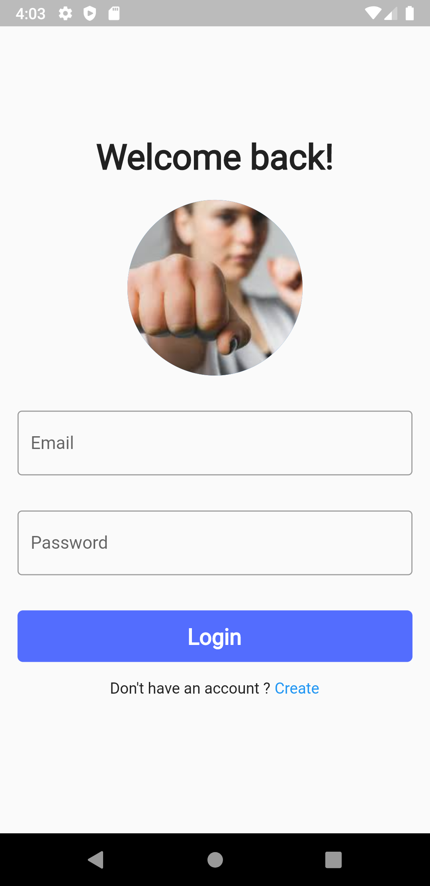
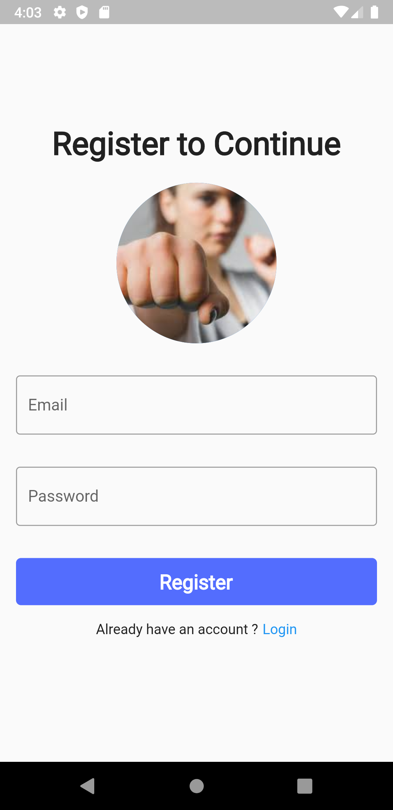
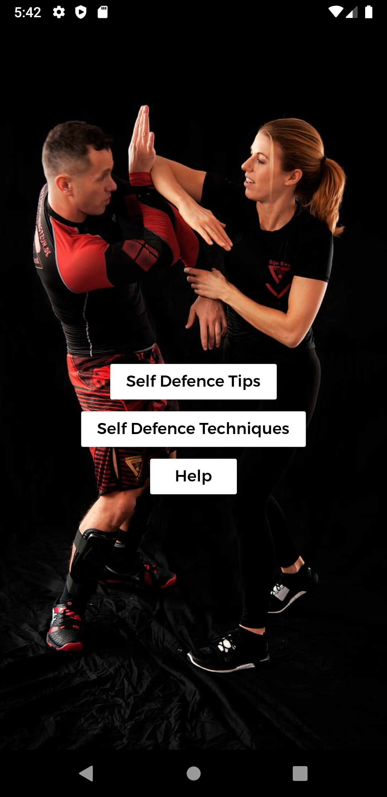
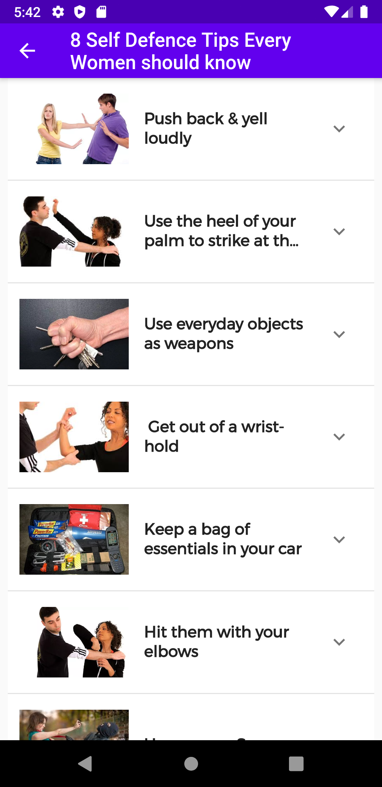
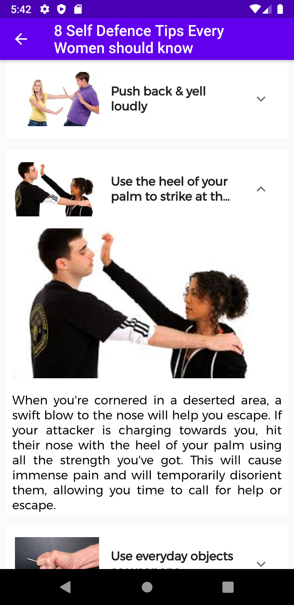
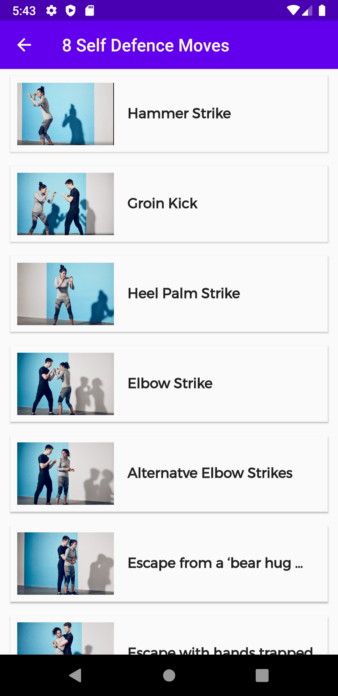
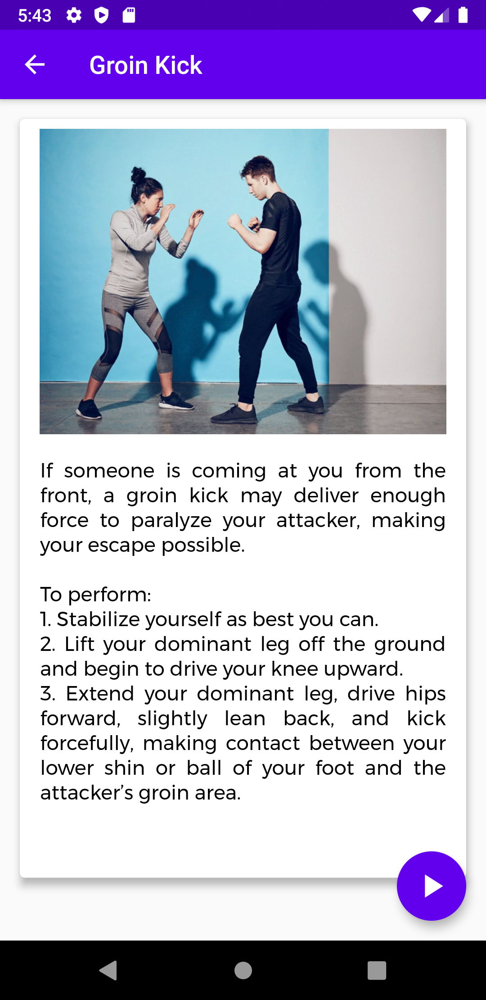
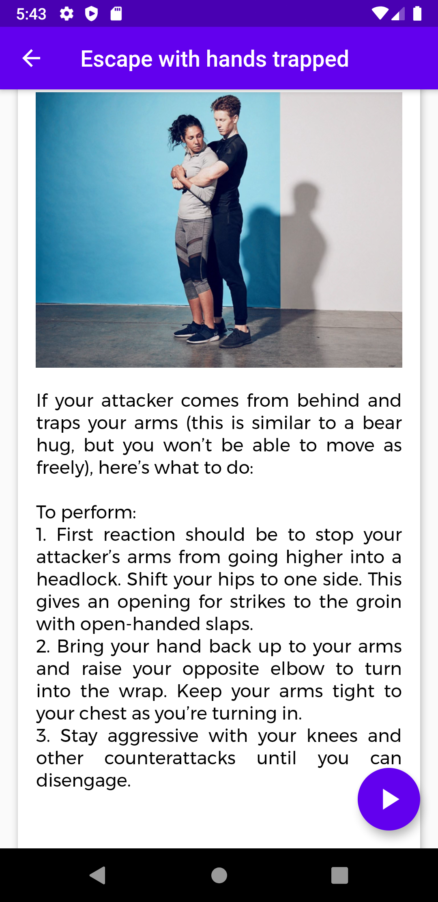
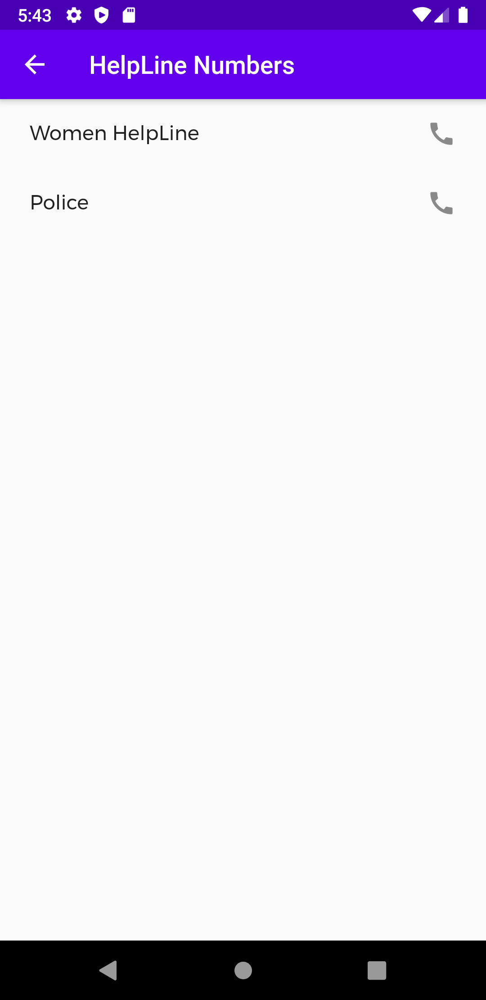

<h1 align="center">Self  Defence App for Women</h1>
<h3 align="center"><i>"Because safety comes first"</i></h3>

## Inspiration

Recently I was scrolling through the Google's solution challenge page. There were various goals for development. The goals were No poverty, Zero hunger, Quality Education, Gender Equality, etc.This project satisfies one sustainable Goal out of the 17 Sustainable Goal of United Nations. So I decided to make a project which will Gender equality and Women's Empowerment. Also Women's Day is coming on 8th March, so this was the perfect theme for this project. I have developed a Cross platform, Self Defence App for women. This is built using Flutter and is available on Android and IOS. 

## What it does

This App offers various options as Self defence tips, Self defence moves with videos and steps and a speed dial helpline number. It also has firebase authentication.

## How we built it

I have used Firebase, Dart & Flutter to build this App.

## Challenges we ran into

The challenge was setting up the authentication and email verification.

## Accomplishments that we're proud of

I have successfully developed a cross platform application with a good authentication system.

## What we learned

I have learnt about I have learnt about Firebase and Firebase authentication and I have replaced the deprecated widgets of Flutter.

## What's next for Self Defence App

In Future I'll try to publish this App on Web.

## Screenshots

 &emsp;  &emsp;     

  &emsp;  &emsp;     

 &emsp;  &emsp;    

